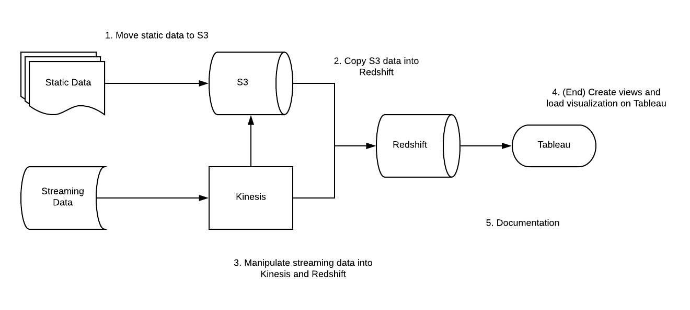

# W205 Final Project
###### James Black, Ramsey Magana, Aniruddh Nautiyal, Rich Ung

## Overview

### Scope

The purpose of this project is to design an end-to-end data flow and visualize transportation data. We use a lambda function and python scripts to pull data from various APIs into S3 and Amazon Kinesis, and further pipe the data into Amazon Redshift, our serving layer. This will allow users to see the latest position of a vehicle in real-time and allow users to filter the vehicle by variables such as the operator name.
* Since we are streaming data with Amazon Kinesis, we are involving real-time analytics (velocity).
* We are using multiple data sources ("GTFS Operator List", trips.txt files from the "GTFS DataFeed", and the "GTFS-Realtime Vehicle Positions" API to simulate streaming data) that are cleaned and merged to create the final view table, "latest_position".
* Since S3 is highly scalable and acts as our storage layer, and Amazon Kinesis can scale out to handle more data by simply adding more shards, this solution has the potential to handle high volumes of data.

### Functional

This GitHub repository includes all code that's necessary to execute our end-to-end data flow.
* We combine 3 different datasets together when creating our final view table for Tableau.
* We regularly update our data through streaming new data into Kinesis.
* We clean the data when ingesting the static tables by adding an "Agency" column to one of our datasets and remove whitespaces between trip_ids in order to perform a proper join between the datasets
* We believe that this will help provide an easy experience for the end user to see the current location of a vehicle in real-time.

### Design/Architecture

We chose to use an AWS ecosystem (Lambda functions, Kinesis, S3, and Redshift) because we believe its native services would simplify our tools and processes. These services also require minimal server maintenance, and allows us to build a more serverless architecture.
* This solution is capable of scaling as we add more data into S3, Kinesis, and Redshift since Kinesis only requires more shards if we add more data and Redshift only requires more nodes of we add more data
* This implementation also has clear processing and service layers
  * Processing layers: S3, Python scripts, and Kinesis Firehose
  * Serving layer: Amazon Redshift

### Additional Information

We can scale this solution by simply adding more data into S3 through Python scripts if they are static datasets, or use Amazon Kinesis to pipe data into S3 and Redshift if they are streaming datasets. This allows to scale our solution in the future by either having more services connect to Amazon Kinesis to handle real-time processing, or use Amazon EMR (Elastic MapReduce) to run Spark or Hadoop based jobs on our S3 datasets (which we can use as our source of truth and large scale data processing). In the future, we envision additional datasets are incorporated by piping them into S3 and Kinesis, and future processing and technological needs are incorporated by having these additional technologies (such as Spark or Hive) to connect to S3 and Kinesis for additional processing.

## Set-Up Instructions
Refer to [W205 Final Project Set-Up Instructions.pdf]('./W205%20Final%20Project%20Set-Up%20Instructions.pdf').

**Note: All access keys, secret keys, and username/passwords are deactivated and must be replaced with new credentials that are created while going through the guide.**

## Powerpoint Presentation
* Final Presentation Powerpoint
  * In Powerpoints folder
* Proposal Powerpoint
  * In Powerpoints folder
* Progress Powerpoint
  * In Powerpoints folder

## Colaboratory Doc
The colaboratory code can be found [here](https://colab.research.google.com/notebook#fileId=1QWwCsd6YLo3iBQVce0Hs_I-ldoACU1AY) or can be found locally at "load_static_datasets\W205 Final Project"

## Diagrams

### Data Source
* GTFS-Realtime Vehicle Positions
  * GTFS-realtime Vehicle Positions service produces realtime information about the vehicles including location and congestion level.
  * Example API Call:
    * http://api.511.org/Transit/VehiclePositions?api_key=c446f9f0-5979-4667-a37b-d31b41480fa9&
* GTFS Operator List
  * GTFS Operator List is the list of operators/agencies that have GTFS dataset available via Open511 APIs.
  * Example API Call:
    * http://api.511.org/transit/gtfsoperators?api_key=c446f9f0-5979-4667-a37b-d31b41480fa9
* GTFS DataFeed download
  * GTFS datafeed download allows the user to download a zip file containing GTFS dataset for the specified operator/agency
  * The zip file contains the text files corresponding to the GTFS file formats. It also contains additional files, called the GTFS+ files, that provide information that is not contained in the GTFS files such as the direction names, farezone names, etc. The list of GTFS+ files and their data structures are provided in Appendix D of this document
  * When the request is processed successfully, the user will receive a zip file attachment in response to this API.
  * Example API Call:
    * http://api.511.org/transit/datafeeds?api_key=c446f9f0-5979-4667-a37b-d31b41480fa9&operator_id=AC

## Redshift Access Instructions
* Follow steps located here:
  * http://docs.aws.amazon.com/redshift/latest/gsg/rs-gsg-connect-to-cluster.html
* Download a SQL query tool such as SQL Workbench/J:
  * http://www.sql-workbench.net/downloads.html
* JDBC Driver is located within github repo
  * RedshiftJDBC42-1.2.10.1009.jar
